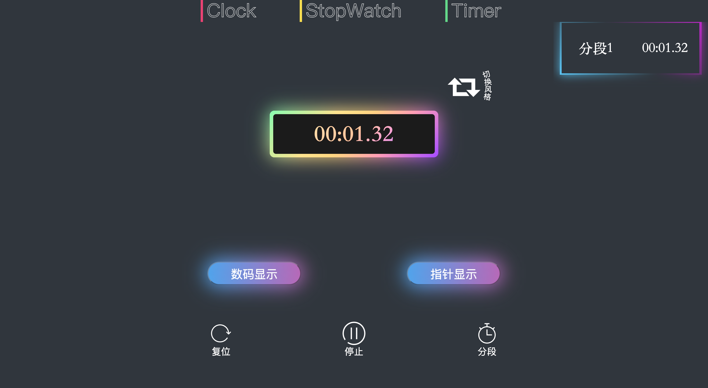

# 大作业说明文档

姚润茂 2021011785 yrm21@mails.tsinghua.edu.cn

罗一鹤 2021011538 2975587905@qq.com

方钧同 2021011783 fangjt21@mails.tsinghua.edu.cn
*在这里添加：姓名 学号 邮箱*

### 实现思路
#### 整体框架  （钟健坤）

###### 布局

为了建立一个能够统一给三个应用使用的布局，将整个页面规划为了四个区域：  
* 导航栏：负责页面间的切换，独立于各页面具体的逻辑；  
* 左侧边栏：作为陈列信息的空间，显示详细信息；
* 右侧边栏：和左侧边栏相似，在之后的开发过程中逐渐被用于展示多项元素；
* 中部空间：用于展示时钟/时间，包含页面的核心部分。  

###### UI设计（姚润茂）

导航栏：

+ 设置了伪类`before`的动画，在鼠标悬停的时候，`before`的文字宽度由0增长到100，实现一个从左到右的遮盖效果

背景：

+ 由浅色UI调整为深色UI

#### 时钟（方钧同）

###### 表盘绘制

主要将部件分为`scale`，`hands`，`center`，`timetext`和`buttons`5个g标签，便于统一管理和每次更新时的初始化。

`scale`中包括表盘的所有部件以及刻度。`hands`中包含三个表针，每个表针由一个rect和一个circle组成，颜色统一。`center`出现的原因在于svg没有z-index属性，仅能通过先后出现的顺序来决定覆盖关系。`timetext`涉及时间的显示及其边框，而`buttons`则是对应的调节按钮。由于svg没有box-shadow属性，只能通过包含feDropShadow的filter来实现对应的阴影效果。

为了保证表盘随用户界面的缩放，定义了相对长度单位`v`，每次页面缩放时会清空表盘的所有内容，并按照相对大小重新绘制。

###### 功能实现

时钟正常的运行通过调用自定义的`time`类中的`tick()`方法，设定间隔为20ms的定时器。

通过参数设置时间的实现也较为简单，只需要将对应按钮的`onclick`时间的监听函数设为`tick()`或`tick_reverse`对应次数即可。利用localStorage记录修改后时间与实际时间的差值，已达到记录的效果。

难点在于拖动调整功能的实现。要实现不同指针的联动，则需要随着鼠标的移动实时更新后台用于记录时间的`global.globalTime`。实现的方法为用一变量`lastAngle`记录上次更新时指针的角度(实际编写中为了代码的复用性考虑，`lastAngle`为一数组)，当这一时刻角度的改变量大于每个指针的阈值时(即20ms对应的角度)，则更新`global.globalTime`与`lastAngle`。这样便能达到实时更新与表针联动的效果。

为了正确的实现拖动功能，重写了表盘的`mousemove`监听函数。考虑到三个指针对应的监听函数并不同，因此采用鼠标按下时安装对应监听器，松开时则移出的方法。

#### 闹钟  （徐超）

###### UI设计

添加闹钟按钮UI（姚润茂）：

+ 由一个`
`标签和四个``标签组成，前者用于实现按钮主体，后者用于实现按钮四周的四个荧光条
+ 在`hover`的时候调整四个``的位置平移到按钮主体中，大小由1减为0，同时主体的背景色更换为亮蓝色并设置伪类`before`以实现荧光效果

#### 秒表  （姚润茂）

###### UI设计

显示组件UI：

+ 数码彩虹表盘：给背景设置了一个渐变色，并额外添加动画去修改滤镜的`hue-rotate()`以达到色调旋转的效果
+ 数码霓虹表盘：使用了四个`svg`的`<text>`标签，四个标签的`stroke`参数为四种颜色，核心在于参数`stroke-dasharray`的修改，该参数用于绘制虚线，另外再加上动画来改变`stroke-dashoffset`参数以达到滚动的效果
+ 指针简约表盘：完全利用`svg`绘制的表盘，额外增加了上下“漂浮”的动画，实际上就是在关键帧里改变Y轴偏移量
+ 指针霓虹表盘：表盘底色、指针、荧光球、数字刻度都由`css`样式支持，荧光球的轨迹是用`svg`绘制的。绘制方法都比较简单：改背景色，设置`before`和`after`伪类以实现荧光效果

表盘切换按钮UI：

+ 背景是渐变色，把背景放大到400%，这样可以让渐变更自然流畅。除此之外设置了伪类`before`实现荧光阴影效果
+ 当`hover`的时候添加动画，让背景水平移动，达到“流光”效果

基本操作按钮UI：

+ 利用图片充当背景并配上相应文字
+ “切换风格”按钮的文字弧形效果是利用`svg`实现的，方法是让`<text>`标签嵌入到绘制圆弧的`<path>`标签中

分段组件UI：

+ 使用一个`
`包着两个``，``用于显示内容，`
`用于改变边框样式
+ 给`
`的伪类`before`和`after`设置了“蓝-背景色-紫”的渐变色，并且旋转了45度，之所以只呈现出边框显色效果，是因为两个``的背景色是页面背景色，盖住了`
`的大部分，只在四周留出了很小的空间

###### 技术

底层架构：

+ 由一个`stopwatch`类的对象支撑起整个页面。
+ `stopwatch`类保存着时分秒变量、计时器变量，包含修改显示组件等多种方法

启动操作：

+ 点击启动按钮触发`onclick`，计时器每隔一个步长改变一下数码显示的内容，而针对指针显示则是计算角度后修改指针当前所处的位置

暂停操作：

+ 清除计时器

复位操作：

+ 清除计时器并重置各显示组件

分段操作：

+ 调用`appendRecord`方法，先往html里插入分段组件块，然后计时器更新内容显示
+ 分段部分计时器始终更新的是一个`stopwatch`类的`stopWatchControl.current`变量，在有新分段时，该变量会重置，所以每个新分段都是从0开始计时
+ `stopWatchControl.recordCount`变量统计分段数，当有新分段时该变量递增，计时器也是根据该变量来决定更新哪个分段块，所以当有新分段时，原分段会停止显示，只有最新的分段块会开始累积时间

切换风格、数码显示、指针显示操作：

+ 实际四种表盘都画在了页面上，单击按钮的唯一作用就是决定哪个组件的`visibility`属性是可见的，其余三个组件都是处于隐藏状态

“换页不停表”：

+ 每隔一段时间就会把当前页面的关键信息保存在`localstorage`中，在每次进入秒表页面时会初始化一下，如果是第一次进入，那就默认初始化，否则就在上次离开页面时保存的状态的基础上做适当更新后初始化
+ 最重要的是能够在离开页面的过程中让秒表和最后的分段组件一直“走”，实现思路是记录时间戳，利用离开页面和返回页面的时间戳的差值来更新页面时间，实际上在离开页面的过程中表并不走，只是记下了这段时间，在用户返回页面后营造一种“表一直在走”的假象

#### 计时器  （罗一鹤）

###### UI设计（姚润茂）

显示组件UI：

+ 表盘由两部分组成：其一是纯灰色的圆环表盘底，其二是渐变蓝色的进度条，都利用`svg`的`circle`标签绘制。
+ 数字显示部分：由`
`和``标签组成

设置时间部分UI：

+ 四个``标签分别显示“设置时间”、“小时”、“分钟”、“秒”
+ 三个`<select>`标签实现时分秒的下拉选框

基本操作按钮UI：

+ 利用图片充当背景并配上相应文字
###### 技术

底层架构：

+ 由对update()函数的调用实现计时器的计时。
启动操作：

+ 点击“开始计时”按钮触发`starttimer`，计时器每隔20ms改变钟表显示的内容，而针对指针显示则是计算角度后修改指针当前所处的位置

暂停操作：

+ 点击“暂停”按钮触发`pausetimer`，计时器改变参数，停止更新，开始时同“换页不停表”方式开始计时，不过此时刷新了开始时间，因此等同于暂停

复位操作：

+ 点击“取消”按钮触发`restarttimer`清除计时器并重置各显示组件

“换页不停表”：

+ 同秒表的实现方式
***
### 使用说明

#### 时钟

进入网页默认显示时钟，时钟默认设置为与北京时间相同。

可通过拖动表针设置时间，不同表针之间有联动。

也可通过`ADJUST`按钮调整，按下后时间会暂停，可分别设置时分秒，`RESET`为重设回默认时间，`CONFIRM`为确定，此时仍可动过拖动表针修改时间。

#### 闹钟  
#### 秒表  

点击下方启动按钮可以启动秒表

点击下方停止按钮可以暂停秒表

在**秒表启动的过程中**点击下方分段按钮可以分段

点击下方复位按钮可以将秒表清零

点击中间数码显示/指针显示按钮可以切换显示模式，点击切换风格按钮可以在**同一模式内**更换表盘

#### 计时器  
设置时间后，点击“开始计时”启动计时器，启动时点击“暂停”暂停计时器，在任意时刻点击“取消”来重置计时器
***
### 遇到的问题及解决方案

#### 时钟

**问题：**开始时拖动，每次转过一圈后，上一级的时间无法正确更新

**解决方案：**这是由于返回角度的函数在$269^。$到$-89^。$之间不连续导致的，在更新了特殊情况的判断后得到了解决。

#### 秒表

**问题一**：实现存储功能的过程中，不知道该如何实现时间的保存，因为并不知道用户什么时候离开页面，所以也就无法准确记录离开的时间点

**解决方案**：每隔50毫秒就记录一下当前的时间戳，以最后记录的时间戳来近似用户离开页面的时间点，这样能最大程度上的减小误差

**问题二**：在页面初始化的过程中需要区分两种情况，其一是首次打开页面的初始化，其次是离开页面后返回页面的初始化，在首次初始化环节总是会出一些显示组件相关的bug

**解决方案**：问题出在条件判断`localstorage.hasOwnProperty()`，如果是首次打开页面，条件判断返回的会是`undefined`，起初未考虑到这一点，以为返回的会是空串

**问题三**：起初分段计时器和主计时器是分开的，这导致了分段组件显示的时间和表盘时间对不上

**解决方案**：首先问题是出在重新设置计时器会有几毫秒的延迟，后来改成了只使用一个主计时器，在主计时器的函数体中增加更新分段内容的语句，不再额外增设分段计时器
#### 计时器
**问题一**：实现存储功能的过程中，判断true和false无效

**解决方案**：localstorage只能存储字符串，必须用字符串进行判断

**问题二**：计时器在停止时不能复位

**解决方案**：alert是优先执行的，会打断其他行的执行，使用另一个函数包裹后延时执行即可

**问题三**：计时器外部圆圈从右方开始转动而并非上方

**解决方案**：transform="translate(0,300) rotate(-90)"
***
### 参考资料
1. [W3school](https://www.w3school.com.cn/)
2. [菜鸟教程](https://www.runoob.com/html/html-tutorial.html)
3. [HTML + CSS 实现矩形/圆形进度条效果 - SVG](https://blog.csdn.net/qq_43551801/article/details/128115314)
4. [前端HTML+CSS完成这么高级的酷炫时钟效果，不学真可惜了](https://www.bilibili.com/video/BV1PQ4y1y7NU/?spm_id_from=333.337.search-card.all.click)
5. [SVG实现超级酷炫时钟](https://www.bilibili.com/video/BV1o54y1879H/?spm_id_from=333.337.search-card.all.click)
6. [使用 Html CSS SVG 工作模拟时钟 | JavaScript 时钟](https://www.bilibili.com/video/BV1oh4y1J7kw/?spm_id_from=333.337.search-card.all.click)
7. [【HTML+CSS】CSS3实现炫酷的流光按钮效果](https://www.bilibili.com/video/BV1cK4y1k7qG/?spm_id_from=333.337.search-card.all.click)
8. [使用HTML和CSS创建独特的按钮悬停效果](https://www.bilibili.com/video/BV1iM411C7oN/?spm_id_from=333.337.search-card.all.click)
9. [未来主义的CSS动画按钮](https://www.bilibili.com/video/BV1Pm4y1U7GR/?spm_id_from=333.337.search-card.all.click)
10. [[HTML&CSS] 创意菜单悬停动画效果](https://www.bilibili.com/video/BV1LV4y1n7eb/?spm_id_from=333.337.search-card.all.click)
11. [【网页设计】用CSS给你的网页制作一个动态闹钟](https://www.bilibili.com/video/BV1j94y127ou/?buvid=Y640326A5398443344148AB304027CDC9474&is_story_h5=false&mid=CQQQFBBe6iyNdG8WzToCBw%3D%3D&p=1&plat_id=116&share_from=ugc&share_medium=iphone&share_plat=ios&share_session_id=843F4374-5B68-456B-A427-D92EB4660DA4&share_source=WEIXIN&share_tag=s_i&timestamp=1690106620&unique_k=HvRdMGQ&up_id=288724&vd_source=14d0c4b582d6968197d86af9fb6c9447)
